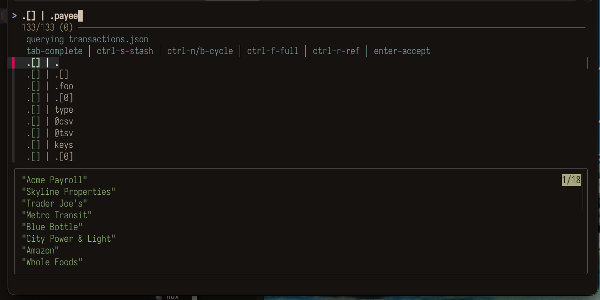
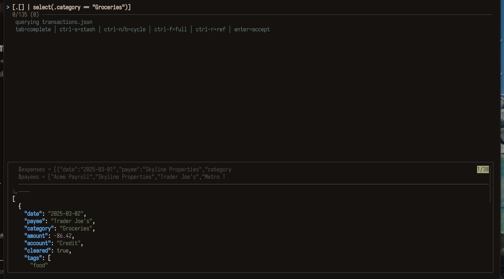
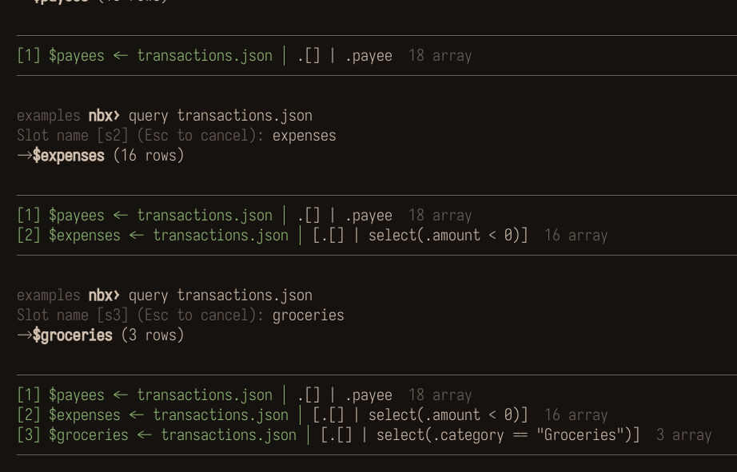

# nbx - Interactive jq notebook

CLI-first notebook for exploring JSON/CSV files. Uses `.ipynb` format but no Jupyter runtime - just bash, jq, and fzf.

Live jq editor with structure-aware autocomplete and a running preview:



Filters preview instantly, with your slots shown above the result:



Each accepted query becomes a named slot; steps stack into a notebook you can chain, edit, and save:



## Install

**zinit** (as a command on your `$PATH`)

```sh
zinit ice as"command" pick"bin/nbx"
zinit light mracos/nbx
```

or inside a `zinit for` block:

```sh
pick"bin/nbx" mracos/nbx
```

**Clone + PATH**

```sh
git clone https://github.com/mracos/nbx ~/.nbx
export PATH="$HOME/.nbx/bin:$PATH"
```

## Requirements

- **bash** 3.2+ (macOS stock bash works)
- **[jq](https://jqlang.github.io/jq/)** - JSON query engine (required)
- **[fzf](https://github.com/junegunn/fzf)** - interactive query editor and pickers (required)

## What it does

- **Live query editor** - type jq expressions, see results update in real-time (fzf preview)
- **Autocomplete** - suggestions built from your data structure + common jq patterns
- **Named slots** - each query result is saved as `$s1`, `$s2`, etc. for chaining
- **Row selection** - pick specific rows from results with fzf multi-select
- **Pipeline** - pipe one slot's output into the next query
- **Notebook persistence** - save/load as `.ipynb`, viewable on GitHub and VS Code
- **jq cheatsheet** - built-in reference, accessible mid-query with ctrl-r

## Try it

A demo dataset ships in `examples/transactions.json` (one month of personal
transactions). Launch nbx on it and you drop straight into the live query editor,
with a `querying transactions.json` hint at the top:

```bash
nbx examples/transactions.json
```

Queries to try (type them in the editor, watch the preview update):

```jq
.[] | .payee                              # every payee
[.[] | select(.amount < 0)]               # expenses only
[.[] | select(.category == "Groceries")]  # one category
[.[] | select(.tags | index("food"))]     # by tag
group_by(.category)
  | map({category: .[0].category, total: (map(.amount) | add)})
  | sort_by(.total)                        # spend per category
[.[] | select(.cleared == false)]         # not yet cleared
```

Slots chain results: accept a query as `$s1`, then `set budget -100` and run
`.[] | select(.amount < $budget)` to reuse the value. `ctrl-r` opens the jq
cheatsheet mid-query; `help` lists every command; `ref full` adds the jq manual.

## Usage

```bash
# Ephemeral session (no save)
nbx users.json orders.json

# With a notebook file (save/load)
nbx analysis.ipynb users.json orders.json

# Resume a saved analysis
nbx analysis.ipynb

# Start from a command's output (any non-file arg is run as a command)
nbx 'gh api /user/repos'             # quote it; repeatable

# Just the cheatsheet
nbx ref
nbx ref full    # includes jq --help
```

### Command sources

A command source is just a source whose data comes from a command's stdout,
labelled `cmd1`, `cmd2`, … Two ways to make one:

```bash
nbx 'gh api /user/repos'           # launch arg → source "cmd1"
```
```
nbx› query gh api /user/repos      # in-REPL    → source "cmd1", then jq editor
```

At launch, any positional arg that isn't an existing file (or `.ipynb`) is run as
a command (quote it so the shell passes it as one arg). In the REPL, `query`
takes a command in the same slot as a file or `$slot`: it captures the source and
opens the jq editor on it in one step. Once made, a command source behaves like
any file source: `query cmd1`, `show`, `refresh cmd1`, etc.

Persistence (see [ADR 0010](docs/adrs/0010-nbx-command-sources.md)):

- **Every source is snapshotted into the `.ipynb`** (`metadata.nbx.command_sources`)
- **Command sources also store their command**, so `refresh [source]` re-runs it

```
refresh            Re-run all command sources
refresh cmd1       Re-run just that source
```

**Non-JSON output is auto-wrapped.** jq only speaks JSON, so if a command emits plain text, nbx wraps its lines into a JSON string array (`["line1","line2",…]`) so the source is immediately queryable (`.[] | select(test("..."))`).

Real JSON and NDJSON pass through untouched. For structured text (CSV, columns), still convert in the command for richer shape, e.g. `nbx 'mlr --icsv --ojson cat x.csv'` or `nbx 'ps aux | tail -n+2 | jq -Rn "[inputs|split(\" +\";\"\")]"'`.

## Commands

| Command | Short | What |
|---------|-------|------|
| `query [file\|$slot\|cmd]` | `q` | Pick source (or run a command), write jq filter with live preview |
| `pick [$slot]` | | Select specific rows from results |
| `show [slot...]` | `s` | View slot contents (fzf pager) |
| `show -l` | | List all slots with compact preview |
| `refresh [source]` | | Re-run a command source, re-capture (no arg = all) |
| `edit N` | `e` | Re-edit step N (focus mode when pinned) |
| `delete [N]` | `d` | Delete step N (no arg = last step) |
| `ref [full]` | `r` | jq cheatsheet |
| `save` | | Save notebook to .ipynb |
| `reset` | | Clear notebook |
| `help` | `h` | Show commands |
| `quit` | | Exit (prompts to save if dirty) |


## Query editor keybindings

| Key | Action |
|-----|--------|
| Type | jq expression with live preview |
| Tab | Insert selected suggestion into query |
| Ctrl-r | Open jq cheatsheet |
| Enter | Accept query |
| Ctrl-c | Cancel |


**State model:** Temp directory with `slots/` (named JSON files) and `history/` (numbered TSV entries). Each history entry: `input\tfilter\tslot\ttype`.

**Persistence:** `.ipynb` v4 format, read/written with pure jq. Each cell stores nbx metadata (`slot`, `type`, `input`, `filter`) in `metadata.nbx`. On load, cells are re-executed against source files; falls back to cached output if sources are missing.

**Save model:** Actions save a draft to `$JQX_DIR/.draft.ipynb` (temp, auto-cleaned). The actual `.ipynb` file is only written on explicit `save` or confirmed on `quit`.

## Dependencies

- bash
- jq
- fzf

## Design decisions

See `docs/adrs/`:

## How it started

Started as "make me a small CLI to play with JSON files using jq." Evolved through:

1. **Query scratchpad** - fzf with live jq preview, named slots for chaining
2. **Notebook feel** - visible step history, row selection (`pick`), edit-and-rerun
3. **Persistence** - `.ipynb` format for save/load, no Jupyter runtime
4. **Extraction candidate** - designed to eventually become a standalone tool (`mracos/nbx`)

The key insight: Jupyter notebooks are the right *format* but the wrong *runtime* for this use case. nbx uses the format for portability while providing a data-aware UX that Jupyter frontends don't offer (live preview, structure autocomplete, row picking).

## Provenance

Read-only mirror, generated and kept in sync by CI. PRs here are cherry-picked upstream and synced back, so open a PR rather than editing directly.
